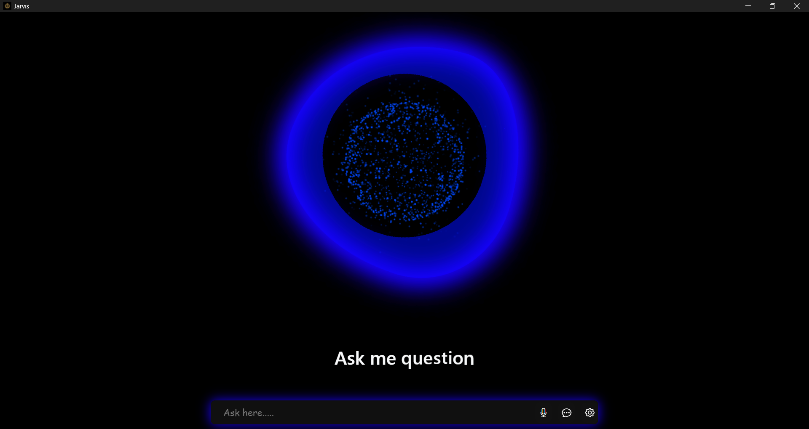

# Jarvis - AI Voice Assistant in Python


## 🚀 Overview

Jarvis is an advanced, modular voice assistant built using Python, HTML, CSS, JavaScript, and various powerful libraries and APIs. It mimics Iron Man's AI assistant and can perform tasks like voice interaction, YouTube playback, WhatsApp messaging/calling, SQLite interaction, Android automation using ADB, face recognition, and more.

This project is developed through a day-wise tutorial series, where each day focuses on building and integrating new features.

---

## 📊 Features

* Face Recognition-based authentication
* Hotword Detection ("Jarvis")
* Speech Recognition and Text-to-Speech
* Mic Click Animation and Siri Wave Effects
* WhatsApp Messaging and Calling
* YouTube Video Playback
* SQLite-based command and contact storage
* HuggingFace Chat Integration
* Mobile Automation with ADB (calls, taps, SMS)
* Voice-controlled App and Website Launching
* Chat History Feature

---
## 🔍 Demo Image



---

## ⚖️ Tech Stack

* **Backend**: Python, Eel
* **Frontend**: HTML, CSS, JavaScript (Lottie, Particles.js)
* **Automation**: ADB, OpenCV, pywhatkit, pyttsx3
* **Voice**: speechrecognition, playsound
* **AI**: HugChat (Hugging Face)

---

## 📆 Workflow Summary (Video-wise Breakdown)

**Day 1**: Project Setup, Particle Blob Design, GitHub Init

**Day 2**: Virtual Environment, Eel Connection (Python <-> HTML)

**Day 3**: Siri Wave, Input Box, Playsound Integration

**Day 4**: Mic Button Animation, Jarvis Start Sound

**Day 5**: Text-to-Speech with pyttsx3

**Day 6**: Speech Recognition with speechrecognition and pyaudio

**Day 7**: Backend-Frontend Customization

**Day 8**: YouTube & App Launch Commands

**Day 9-10**: SQLite Integration for Contacts & Apps

**Day 11**: Hotword Detection Setup

**Day 12**: WhatsApp Messaging and Calling (pt 1 & 2)

**Day 13-14**: Chatbot & Chat History using HugChat

**Day 15**: HuggingFace Integration (cookie auth, chat)

**Day 16-17**: ADB Phone Call, SMS, Home Navigation

**Day 18**: Final Touch: OpenCV, Lottie files, Particle.js

---

## ♻️ Installation Guide

### 1. Clone the repository

```bash
git clone https://github.com/rishi7838/Jarvis.git
cd Jarvis
```

### 2. Create and activate virtual environment

```bash
python -m venv envjarvis
# Windows
envjarvis\Scripts\activate
# Linux/macOS
source envjarvis/bin/activate
```

### 3. Install dependencies

```bash
pip install -r requirements.txt
```

### 4. Run the app

```bash
python run.py
```

---

## 🌐 Project Structure

```
Jarvis/
│
├── engine/                     # Core    
│   ├── auth/                   # Face recognition files
│   │   ├── collect_samples
│   │   ├── train
│   │   └── haarcascade_frontalface_default.xml
│   ├── controller.py             
automation
│   ├── command.py
│   ├── helper.py
│   ├── feature.py              # AI Chatbox, utilities
│   ├── assistant.py            # Main assistant functions
│
├── static/                     # Frontend (HTML/CSS/JS)
www
│   ├── controller.js
│   ├── index.html
│   ├── style.css
│   └── main.js
│
├── device.bat                 # adb connection
├── cookies.json               # HugChat cookie auth
├── run.py                     # Entry point
├── device.bat                 # ADB script for automation
├── requirements.txt
└── README.md
```

---

## 📁 Sample Commands

* "Jarvis, play Shape of You on YouTube"
* "Jarvis, send WhatsApp message to Rishi"
* "Jarvis, call Rishi"
* "Jarvis, open Notepad"
* "Jarvis, open Google.com"
* "Jarvis, who are you?"

---

## 💼 Requirements (requirements.txt)

```txt
eel
opencv-contrib-python
opencv-python
pyttsx3==2.90
speechrecognition==3.8.1
pyaudio==0.2.11
playsound==1.2.2
pywhatkit
hugchat
requests
```

Note: Install `adb` (Android Debug Bridge) manually and add it to your system PATH.

---

## 🚧 Contribution

Feel free to fork and improve Jarvis. Pull requests are welcome for:

* Bug fixes
* New voice features
* Frontend enhancements
* Integration with new services

---

## 📄 License

[MIT License](https://opensource.org/licenses/MIT)

---

## 🚑 Developer

Developed with ❤️ by [Rishi7838](https://github.com/rishi7838)
